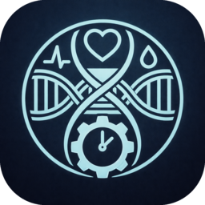

# MortalLoom

<p align="center">
  
</p>

<p align="center">
  <strong>Spend your time on what actually matters.</strong>
</p>

<p align="center">
  Privacy-first life planning for iOS and macOS. Name your North Star, build life pillars, set concrete goals, and measure whether your time really aligns with what matters. Then extend the runway with deep longevity tracking.
</p>

<p align="center">
  No accounts. No servers. No tracking. Your data stays on your device and in your iCloud.
</p>

## App Store Copy

### Subtitle (30 char)

Spend time on what matters

### Promotional Text (170 char)

Name your North Star. Build life pillars. Set concrete goals. Measure whether your time really aligns with what matters, then extend the runway with deep longevity tracking.

### Keywords (100 char max, comma-separated, no spaces)

Paste-ready — Apple already indexes the title and subtitle, and auto-handles singular/plural and keyword cross-combinations.

```
goal,tracker,planner,purpose,longevity,healthspan,biomarker,bloodwork,habit,aging,review,journal
```

Alternative if you want to lean harder into the longevity niche instead of broad goal-tracker intent:

```
goal,tracker,planner,longevity,healthspan,biomarker,bloodwork,genome,epigenetic,habit,aging,purpose
```

### Description

App Store Connect renders the description field as plain text — no Markdown. The block below is paste-ready. It uses uppercase headers, blank lines, and `•` bullets for structure.

```
MortalLoom helps you spend your finite time on what actually matters to you, and extend how much time you get.

Time is the one resource that gates everything else. Every goal you care about (creative, relational, financial, legacy, health) eats time to achieve. Most productivity apps optimize day-to-day throughput. MortalLoom optimizes the direction of a whole life.


ALIGN YOUR TIME

• North Star: Name your single biggest life purpose. Broad, lifelong, no deadline. The thing everything else serves.

• Life Pillars: Build the 3-6 areas that support your North Star: fitness, craft, family, finances, whatever matters to you.

• Concrete Goals: Dated, progress-trackable goals that feed a pillar. Real deadlines, milestones, and % complete.

• Alignment Score: See how much of your recent effort has actually moved the needle on what you said mattered most.

• Stagnation Prompts: When a pillar goes quiet or a goal starts slipping, MortalLoom asks the honest question: what's blocking you, and what can you clear from your calendar to make room?

• Weekly Review: Five minutes to reset alignment and plan the week against what matters.


EXTEND YOUR RUNWAY

Health tracking isn't a side module. Every year you extend your healthspan buys more time for every other goal you care about. MortalLoom includes deep longevity tracking for users whose goals touch health, plus a time-remaining dashboard for everyone else.

• Longevity Clock: Actuarial life expectancy adjusted for your genetics, biomarkers, lifestyle, and Apple Health data.

• Blood & Biomarkers: 50+ blood test markers with clinical reference ranges, trends, and alerts.

• Genome Analysis: Upload your genome for ClinVar cross-referencing and longevity variant analysis.

• Substance Tracking: Alcohol, nicotine, and sauna with NIAAA risk levels and health correlations.

• Apple Health: Steps, heart rate, HRV, sleep stages, VO2 max, cardio recovery.

• LEV 2045: Track your shot at Longevity Escape Velocity. You don't have to solve aging; just survive long enough for the science to.


PRIVACY IS A REQUIREMENT, NOT A TRADEOFF

Your goals and your health data are the most sensitive data you have. MortalLoom is built around that.

• No accounts, no logins, no servers
• No data collection, no telemetry, no analytics
• No third-party SDKs, no ad networks, no tracking
• Data lives on-device and in your personal iCloud
• Export anytime in standard formats. Your data is always yours.


ONE-TIME PURCHASE

Pro is a single $9.99 unlock. No subscription, no recurring fees. All current and future features included.

MortalLoom is for informational and educational purposes only. It is not a medical device and does not provide medical advice.
```

## Features

**Align your time**

- **North Star**: Name your single lifelong purpose
- **Life Pillars**: 3-6 supporting areas that shape the rest
- **Concrete Goals**: Dated, progress-trackable goals that feed a pillar
- **Alignment Score**: How much recent effort has actually moved the needle
- **Stagnation Prompts**: Reflection cues when a pillar or goal goes quiet
- **Weekly Review**: Five-minute reset to plan the week around what matters

**Extend your runway**

- **Longevity Clock**: Life expectancy adjusted for genetics, biomarkers, lifestyle, and Apple Health
- **Epigenetic Age**: Track biological vs chronological age
- **Blood Tests**: 50+ lab markers with reference ranges and trend tracking
- **Body Composition**: Weight, body fat, and eye prescription history
- **Substance Tracking**: Alcohol and nicotine logging with NIAAA risk levels
- **Genome Analysis**: Upload 23andMe/AncestryDNA data, cross-reference ClinVar
- **Apple Health**: Steps, heart rate, HRV, sleep, VO2 max, and more
- **Lifestyle Assessment**: Quantify how habits affect your longevity estimate
- **Life Calendar**: 4000-weeks grid visualization of your entire lifespan
- **LEV Tracker**: Monitor progress toward Longevity Escape Velocity (2045)

## Privacy

MortalLoom collects zero data. There are no analytics, no telemetry, no third-party SDKs, and no server-side components. All data is stored locally on your device and optionally synced via your personal iCloud account. You can export your data anytime.

## Development

### Prerequisites

- Xcode 16+
- [XcodeGen](https://github.com/yonaskolb/XcodeGen) (`brew install xcodegen`)
- Apple Developer account (Team ID: TYQ32QCF6K)

### Setup

```bash
# Clone
git clone git@github.com:atomantic/MortalLoom.git
cd MortalLoom

# Configure deployment credentials
cp .env.example .env
# Edit .env with your App Store Connect API key details

# Generate Xcode project
xcodegen generate

# Build
xcodebuild build -project MortalLoom.xcodeproj -scheme MortalLoom_iOS \
  -destination 'platform=iOS Simulator,name=iPhone 16' \
  -configuration Debug CODE_SIGNING_ALLOWED=NO -quiet
```

### Deploy to TestFlight

```bash
./deploy.sh              # iOS only
./deploy.sh --macos      # macOS only
./deploy.sh --all        # Both platforms
./deploy.sh --skip-tests # Skip test run
```

### Project Structure

```
MortalLoom/
├── App/          # Entry point, Info.plist, entitlements
├── Theme/        # Adaptive colors, layout constants, card styles
├── Views/        # SwiftUI views per feature section
├── Engine/       # Pure computation (longevity clock, risk assessment)
├── Models/       # Data types (health metrics, blood markers)
├── Storage/      # Actor-based file I/O, iCloud sync
```

## Tech Stack

- **Swift 6.0** / **SwiftUI**
- **iOS 17.0+** / **macOS 14.0+**
- **XcodeGen** for project generation
- **HealthKit** for Apple Health integration
- **iCloud Documents** for cross-device sync
- **GitHub Actions** for CI

## License

Proprietary. Copyright 2026 ShadowPuppet, LLC.
